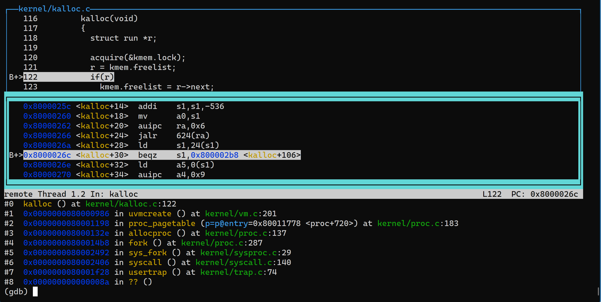

### Pitfalls

- Decrease the page reference count in `kfree()` instead of other places such as `uvmunmap()`. 
  *Because in `kalloc()` the `ref_count` is increased by 1 unconditionally, there will not be any problem to decrease it in `kfree()`.*
- The increase, decrease and read the `ref_count` of a page need a spin lock held. Otherwise there will be concurrency problems. 
  *The bug in this lab has something to do with it. See the following section discussing about the bug.*
- There should be some mechanism to free pages when memory is out in `exec()`. But it seems that `exec()` provides that mechanism. 
  *I do not know how my implementation of COW disturbs the `exec()`.*

### Remaining Bugs

There are sometimes weird bugs when I'm running `usertests`. I believe they are caused by **CONCURRENCY CONTROL** because these bugs occur randomly, which fits the characters of concurrent situation. 

#### Free Page In CONCURRENCY Situation

##### Description

If I make the `xv6` running in single core mode:

```
$ make CPUS=1 qemu
```

Then the `usertests` will succeed(except `execout()` test) without loss of any pages. 

However, if the `xv6` is running in **double cores**, the `usertests` will **fail** because when it executes all tests, the system lost some free pages. In another word, the system did not free all the allocated pages. 

*I tested `forktest` and `echo` in __double core__ situation, both of which __DID NOT suffer loss of free pages__.*

##### Assumption

I suppose that it is because under concurrent situation, `kfree()` may read a non-zero reference count when the real reference count is 0. Therefore, it did not perform `free` when it should do.

##### Solution

A elegant locking scheme is necessary, but I have not come up with one.

I tried some schemes, but they may cause problems in the normal cases.

#### [FIXED] Panic When Memory Is Out

##### Description

`execout()` will cause a kernel panic, which makes it difficult for me to debug.

The log is like this:

```
test execout: kernel_trap(): scause 0x000000000000000f
sepc=0x000000008000026c stval=0x0000000000000000
kernel_trap(): scause 0x000000000000000d
sepc=0x00000000800020f0 stval=0x001000007ff89060
kernel_trap(): scause 0x000000000000000d
sepc=0x00000000800020f0 stval=0x0000010080008fe9
kernel_trap(): scause 0x000000000000000d
sepc=0x00000000800020f0 stval=0x0000000090009068
ref_count[65545] = 0
panic: kerneltrap
```

#### Assumption

I can see that it is first caused by page fault by the instruction at `0x000000008000026c`, which want to access `0x0000000000000000`. 

Because I add a `printf()` just before the `panic()`, when the first panic occurs, it may ruin the sanity of memory. Therefore, the other outputs are not important.

##### Update on 01/21/2021



*In the `gdb` window above, I set a break point at `0x000000008000026c` to see what instruction caused the kernel trap to panic.*

According to `gdb` and the source code, I found that the `execout()` caused page fault in `kalloc()` when it is calling `sbrk()` to allocate all memory. 

As we can see, the faulting instruction is merely judging whether `r` is empty. If `r` is empty, it means that there's no free spaces and `kalloc()` should not execute any allocation of memory and just return `0x0`.

<del>Therefore, the bug is weird: If I did not access the address `0x0`, how could the xv6 raises the page fault indicating that I was trying to write something to the address`0x0`?</del>

**UPDATE: The bug is fixed, I do not know when it is fixed, neither do I know the exact cause of it because when I wanted to catch it, it disappeared.**

