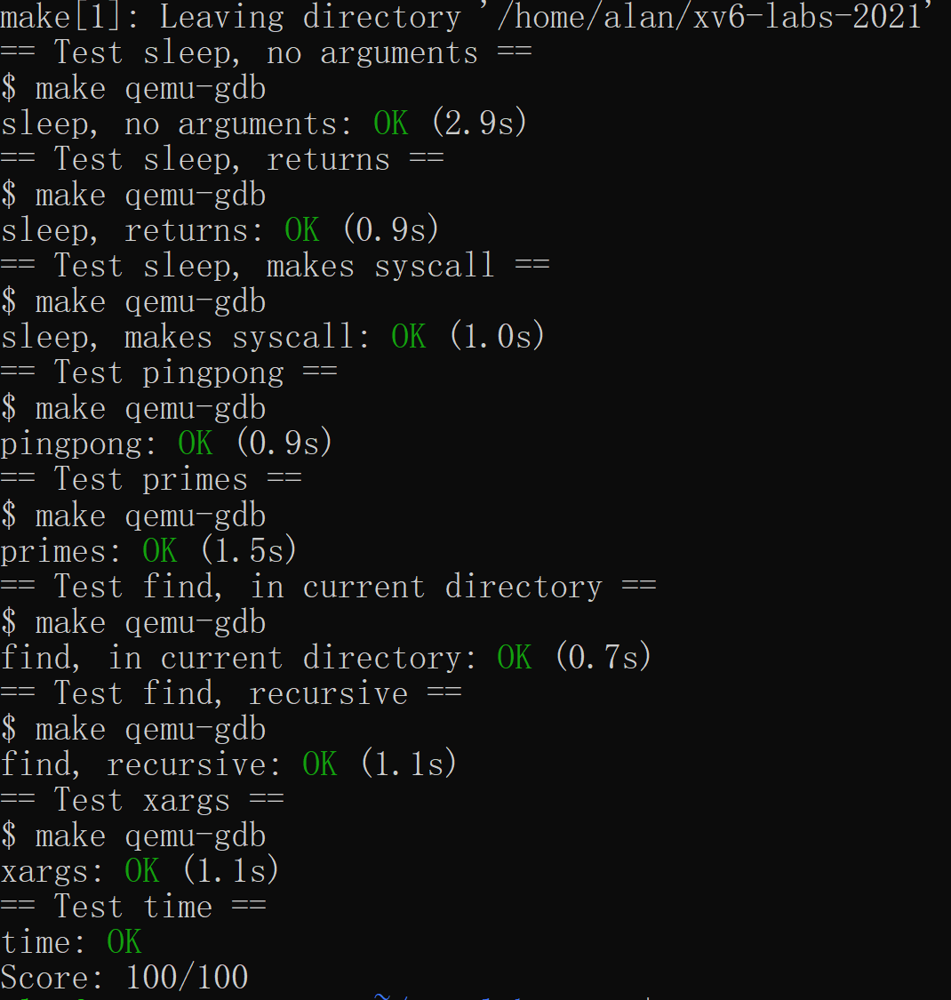
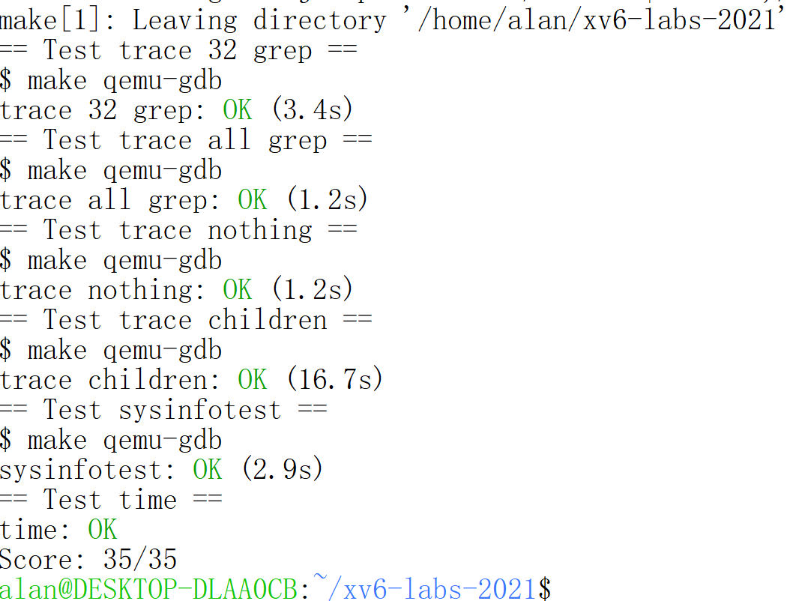
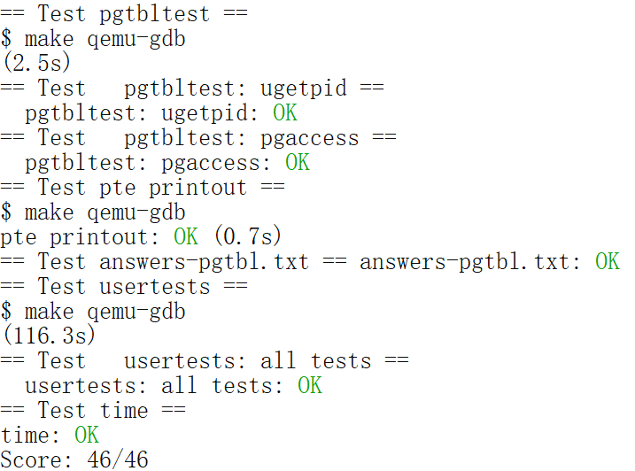
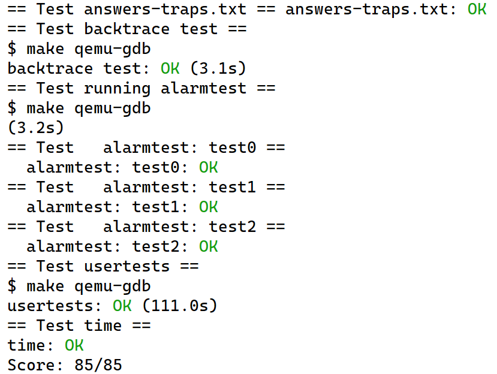
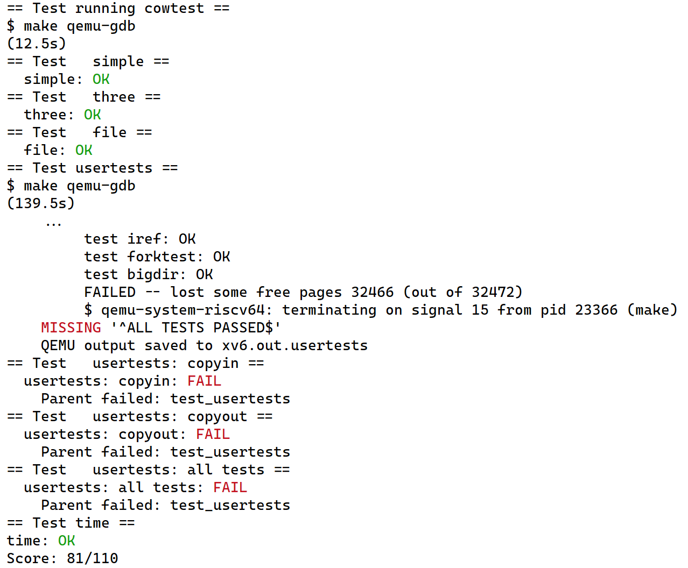

# FOREWORD

This is a **portal** for my project of [MIT 6.S081(Operating System), 2021 Fall](https://pdos.csail.mit.edu/6.S081/2021/schedule.html). 

You can get a glance at what I've done in this project. To further inspect/test my code, please switch branches and see instructions below.

# Build Instructions

**BEFORE BUILDING AND TESTING MY CODE, MAKE SURE THAT YOU HAVE SET UP BUILDING ENVIRONMENT!!!**

### For Debian Or Ubuntu

```
$ sudo apt-get update && sudo apt-get upgrade
$ sudo apt-get install git build-essential gdb-multiarch qemu-system-misc gcc-riscv64-linux-gnu binutils-riscv64-linux-gnu
```

### For Other Systems

**Please refer to [instructions on the course website](https://pdos.csail.mit.edu/6.S081/2021/tools.html).**

# Test Instructions

The test can ONLY be done one by one. 

To inspect my code, **first switch to the branch you wish.** For example, if you want to see my implementation of `Lab Util`, first type:

```
$ git checkout util
```

Then you are free to browse my code for `Lab Util`.

To test it, run:

```
$ make grade
```

It will automatically run all test cases and finally give out my scores.

# Project Overview

*(subject to update because it's currently under progress)*

**Progress: 5 / 10**

## Lab 1 - Unix Utilities

The original requirements can be found [here](https://pdos.csail.mit.edu/6.S081/2021/labs/util.html).

### Tasks

To implement following functions:

- `sleep`: Pause for a user-specified number of ticks
- `pingpong`: Use UNIX system calls to "ping-pong" a byte between two processes over a pair of pipes, one for each direction. 
- `primes`: Write a concurrent version of prime sieve using pipes.
- `find`: Write a simple version of the UNIX find program: find all the files in a directory tree with a specific name.
- `xargs`: Write a simple version of the UNIX xargs program: read lines from the standard input and run a command for each line, supplying the line as arguments to the command.

### Relevant Files

**REMINDER: PLEASE SWITCH TO THE CORRECT BRANCH BY: `$ git checkout util`**

```
user/sleep.c
user/pingpong.c
user/primes.c
user/find.c
user/xargs.c
```

## Lab 2 - System Calls

The original requirements can be found [here](https://pdos.csail.mit.edu/6.S081/2021/labs/syscall.html).

### Tasks

To implement the following two functions in the kernel:

- `trace`: Add a system call tracing feature. It should take one argument, an integer "mask", whose bits specify which system calls to trace. Modify the xv6 kernel to print out a line when each system call is about to return, if the system call's number is set in the mask.
- `sysinfo`: It collects information about the running system. The system call takes one argument: a pointer to a `struct sysinfo` (see `kernel/sysinfo.h`). The kernel should fill out the fields of this struct: the `freemem` field should be set to the number of bytes of free memory, and the `nproc` field should be set to the number of processes whose `state` is not `UNUSED`.

### Relevant Files

**REMINDER: PLEASE SWITCH TO THE CORRECT BRANCH BY: `$ git checkout syscall`**

```
kernel/proc.c
kernel/syscall.c
kernel/kalloc.c
```

## Lab 3 - Page Table

The original requirements can be found [here](https://pdos.csail.mit.edu/6.S081/2021/labs/pgtbl.html).

### Tasks

To implement the following three functions in the kernel:

- **Make it possible for processes in user mode to directly retrieve `pid` without entering kernel.** When each process is created, map one read-only page at `USYSCALL` (a VA defined in `memlayout.h`). At the start of this page, store a `struct usyscall` (also defined in `memlayout.h`), and initialize it to store the `PID` of the current process. 
- `vmprint()`: It should take a `pagetable_t` argument, and print that `pagetable`.
- `sys_pgaccess()`: return the info of accessed pages to the buffer passed in by user.

### Relevant Files

**REMINDER: PLEASE SWITCH TO THE CORRECT BRANCH BY: `$ git checkout pgtbl`**

**See the report in the branch `pgtbl`**

## Lab 4 - Traps

The original requirements can be found [here](https://pdos.csail.mit.edu/6.S081/2021/labs/traps.html).

### Tasks

- Implement the `bakctrace` function to print out the return addresses of the functions which are called.
- Implement `sigalarm(int ticks, (void *handler)())` so that it will set an alarm which will set off at the interval of `ticks`. When the alarm set off, the system will call the `handler` function to handle the alarm. Call `sigalarm(0, 0)` to unset the alarm.

### Relevant Files

**REMINDER: PLEASE SWITCH TO THE CORRECT BRANCH BY: `$ git checkout traps`**

**See the report in the branch `traps`**

## Lab 5 - Copy-On-Write

The original requirements can be found [here](https://pdos.csail.mit.edu/6.S081/2021/labs/cow.html).

### Tasks

To implement copy-on-write fork in the xv6 kernel.

#### Specification

The goal of copy-on-write (COW) `fork()` is to defer allocating and copying physical memory pages for the child until the copies are actually needed, if ever.

COW `fork()` creates just a pagetable for the child, with PTEs for user memory pointing to the parent's physical pages. COW fork() marks all the user PTEs in both parent and child as not writable. When either process tries to write one of these COW pages, the CPU will force a page fault. The kernel page-fault handler detects this case, allocates a page of physical memory for the faulting process, copies the original page into the new page, and modifies the relevant PTE in the faulting process to refer to the new page, this time with the PTE marked writeable. When the page fault handler returns, the user process will be able to write its copy of the page.

COW `fork()` makes freeing of the physical pages that implement user memory a little trickier. A given physical page may be referred to by multiple processes' page tables, and should be freed only when the last reference disappears.

### Detailed Reports

**REMINDER: PLEASE SWITCH TO THE CORRECT BRANCH BY: **

```
$ git checkout cow
```

**See the report in the branch `cow`**

# Test Results

## Lab 1



## Lab 2



## Lab 3



**Note**: *The `usertests` is time-consuming. If your computer has a weak performance, the `usertests` may fail because of time out.*

## Lab 4



## Lab 5

*__Note__: This lab still has bugs in concurrency and `execout()` test.*


